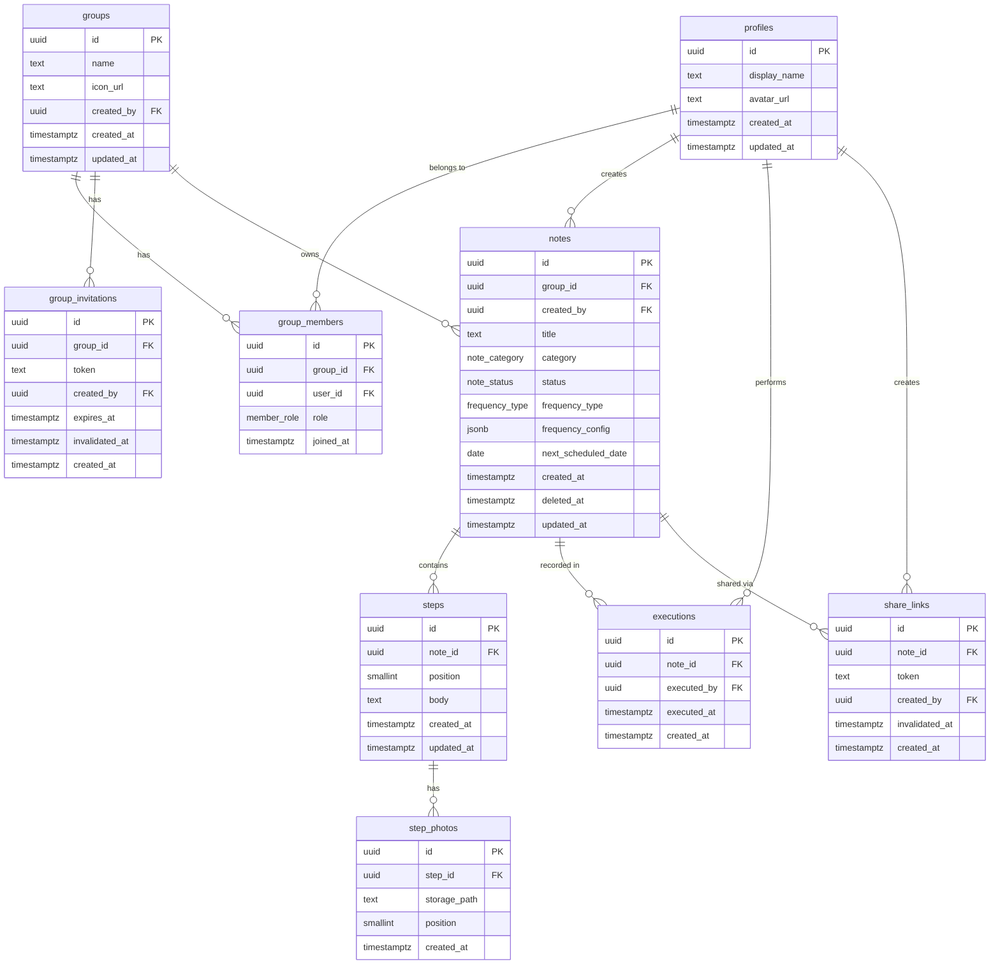

# データベース設計 — kaji-note

Supabase (PostgreSQL 15) を対象としたスキーマ設計書。  
実装は `supabase/migrations/20260501000000_initial_schema.sql` にある。

---

## ER 図



---

## テーブル仕様

### `profiles`

`auth.users` と 1:1 対応するプロフィールテーブル。  
Supabase Auth のサインアップ直後に `handle_new_user()` トリガーが自動生成する。

| 列 | 型 | 制約 | 説明 |
|----|----|------|------|
| `id` | UUID | PK, FK→auth.users | Supabase Auth の UID |
| `display_name` | TEXT | 1〜30文字 | 表示名 |
| `avatar_url` | TEXT | nullable | Storage パス |
| `created_at` | TIMESTAMPTZ | DEFAULT now() | |
| `updated_at` | TIMESTAMPTZ | DEFAULT now() | `set_updated_at()` トリガーで自動更新 |

---

### `groups`

家族・チームを表す単位。1ユーザーが複数グループに所属可能（上限20名/グループ）。  
作成時に `handle_new_group()` トリガーが作成者を `admin` として `group_members` に追加する。

| 列 | 型 | 説明 |
|----|----|------|
| `id` | UUID | |
| `name` | TEXT | 1〜50文字 |
| `icon_url` | TEXT | Storage パス |
| `created_by` | UUID | FK→profiles |
| `created_at` | TIMESTAMPTZ | DEFAULT now() |
| `updated_at` | TIMESTAMPTZ | `set_updated_at()` トリガーで自動更新 |

---

### `group_members`

グループとユーザーの多対多中間テーブル。

| 列 | 型 | 説明 |
|----|----|------|
| `role` | member_role | `admin` / `editor` / `viewer` |
| `joined_at` | TIMESTAMPTZ | |

**権限マトリクス**

| 操作 | admin | editor | viewer |
|------|:-----:|:------:|:------:|
| 手順書閲覧 | ○ | ○ | ○ |
| 手順書作成・編集 | ○ | ○ | — |
| 手順書削除（自作のみ） | ○ | ○ | — |
| 手順書削除（全件） | ○ | — | — |
| 実施済み記録 | ○ | ○ | ○ |
| メンバー招待・管理 | ○ | — | — |
| グループ情報変更 | ○ | — | — |

---

### `group_invitations`

招待リンク。`token` を URL に埋め込んで共有する（例: `app://join/{token}`）。  
有効期限7日。管理者が `invalidated_at` をセットすることで即時無効化できる。

| 列 | 型 | 説明 |
|----|----|------|
| `token` | TEXT | UNIQUE, 36文字 hex, リンクのシークレット |
| `expires_at` | TIMESTAMPTZ | 発行から7日後 |
| `invalidated_at` | TIMESTAMPTZ | 管理者が無効化した日時 |
| `created_at` | TIMESTAMPTZ | DEFAULT now() |

---

### `notes`  (手順書)

| 列 | 型 | 説明 |
|----|----|------|
| `status` | note_status | `draft`（作成者のみ）/ `published`（グループ全員） |
| `category` | note_category | `cleaning` / `cooking` / `laundry` / `storage` / `other` |
| `frequency_type` | frequency_type | 頻度種別 |
| `frequency_config` | JSONB | 頻度パラメーター（下記参照） |
| `next_scheduled_date` | DATE | 次回実施予定日。`executions` INSERT 時にトリガーで更新 |
| `created_at` | TIMESTAMPTZ | DEFAULT now() |
| `deleted_at` | TIMESTAMPTZ | 論理削除フラグ。`soft_delete_note()` RPC 経由で設定する |
| `updated_at` | TIMESTAMPTZ | `set_updated_at()` トリガーで自動更新 |

**`frequency_config` の JSONB 形式**

| frequency_type | JSONB 例 | 意味 |
|----------------|----------|------|
| `none` / `daily` / `seasonal` | `null` | パラメーター不要 |
| `weekly` | `{"days": [1, 3, 5]}` | ISO曜日 (1=月〜7=日) |
| `monthly` | `{"day": 15}` | 毎月15日（月末を超える場合は末日に丸め） |
| `custom` | `{"interval_days": 14}` | 14日ごと |

---

### `steps`

手順書の各ステップ。`position`（1〜30）で順序を管理する。

| 列 | 型 | 制約 | 説明 |
|----|----|------|------|
| `position` | SMALLINT | 1〜30, UNIQUE(note_id, position) | ドラッグ並び替えで更新 |
| `body` | TEXT | 1〜500文字 | ステップ説明文 |
| `created_at` | TIMESTAMPTZ | DEFAULT now() | |
| `updated_at` | TIMESTAMPTZ | DEFAULT now() | `set_updated_at()` トリガーで自動更新 |

---

### `step_photos`

1ステップあたり最大3枚。`storage_path` は Supabase Storage のオブジェクトパス。

| 列 | 型 | 制約 | 説明 |
|----|----|------|------|
| `storage_path` | TEXT | | `step-photos/{note_id}/{step_id}/{id}.jpg` |
| `position` | SMALLINT | 1〜3, UNIQUE(step_id, position) | 表示順 |
| `created_at` | TIMESTAMPTZ | DEFAULT now() | |

---

### `executions`  (実施記録)

実施した事実を不変ログとして保持する（UPDATE/DELETE 不可）。  
INSERT トリガー `handle_new_execution()` が `notes.next_scheduled_date` を再計算する。

| 列 | 型 | 説明 |
|----|----|------|
| `executed_by` | UUID | FK→profiles |
| `executed_at` | TIMESTAMPTZ | 実施日時 |
| `created_at` | TIMESTAMPTZ | DEFAULT now() |

---

### `share_links`  (閲覧専用リンク)

グループ外への閲覧専用共有（認証不要）。  
`token` を知るアクセスに対して、Edge Function が service role で手順書データを返す。

| 列 | 型 | 説明 |
|----|----|------|
| `token` | TEXT | UNIQUE, 36文字 hex |
| `invalidated_at` | TIMESTAMPTZ | admin が無効化した日時（`share_links_update` ポリシーは `is_group_admin` のみ許可） |
| `created_at` | TIMESTAMPTZ | DEFAULT now() |

---

## ENUM 型

```sql
member_role    = 'admin' | 'editor' | 'viewer'
note_status    = 'draft' | 'published'
note_category  = 'cleaning' | 'cooking' | 'laundry' | 'storage' | 'other'
frequency_type = 'none' | 'daily' | 'weekly' | 'monthly' | 'seasonal' | 'custom'
```

---

## Storage バケット

詳細設計は [docs/storage-design.md](./storage-design.md) を参照。実装は `supabase/migrations/20260501000001_storage_setup.sql`。

| バケット | DB 列 | DB 格納形式 | 読み取り | 書き込み |
|----------|-------|------------|---------|---------|
| `avatars` | `profiles.avatar_url` | `avatars/{user_id}/avatar.jpg` | 認証済み全員 | 本人のみ |
| `group-icons` | `groups.icon_url` | `group-icons/{group_id}/icon.jpg` | グループメンバー | admin のみ |
| `step-photos` | `step_photos.storage_path` | `step-photos/{note_id}/{step_id}/{photo_id}.jpg` | グループメンバー（published）/ 本人（draft） | admin / editor |

すべてのバケットは **非公開**。クライアントへの画像配信には Supabase の **署名付き URL** を使用する。

---

## トリガー・関数の一覧

| 名前 | 種別 | 概要 |
|------|------|------|
| `handle_new_user()` | trigger fn | auth.users INSERT → profiles を自動生成 |
| `handle_new_group()` | trigger fn | groups INSERT → 作成者を admin として group_members に追加 |
| `set_updated_at()` | trigger fn | profiles / groups / notes / steps の UPDATE 前に updated_at を更新 |
| `calc_next_scheduled_date()` | pure fn | 頻度設定と実施日から次回予定日を計算（IMMUTABLE） |
| `handle_new_execution()` | trigger fn | executions INSERT → notes.next_scheduled_date を更新 |
| `soft_delete_note(p_note_id)` | RPC | 権限チェック付き論理削除。クライアントは必ずこれを呼ぶ |
| `is_group_member()` / `is_group_admin()` / `can_edit_in_group()` | helper fn | RLS ポリシー内で再帰を避けるための SECURITY DEFINER ヘルパー |

---

## RLS 設計方針

1. **全テーブルで RLS を有効化**。ポリシーが存在しない操作はデフォルト拒否。
2. **SECURITY DEFINER ヘルパー関数**（`is_group_member` など）で `group_members` を参照することで、RLS ポリシー評価の再帰を防ぐ。
3. **削除権限の分離**: 手順書の論理削除（`deleted_at` 更新）は `soft_delete_note()` RPC を唯一の窓口とし、editor が自分のノートのみ削除できるルールをアプリレイヤーではなくデータベース側で施行する。
4. **招待リンク・共有リンクのパブリック読み取り**: トークンそのものをシークレットとして扱うため、有効なレコードは `anon` ロールにも SELECT を許可する。
5. **実施記録 (executions) は追記専用**: UPDATE/DELETE ポリシーを設けないことで不変ログを保証する。
